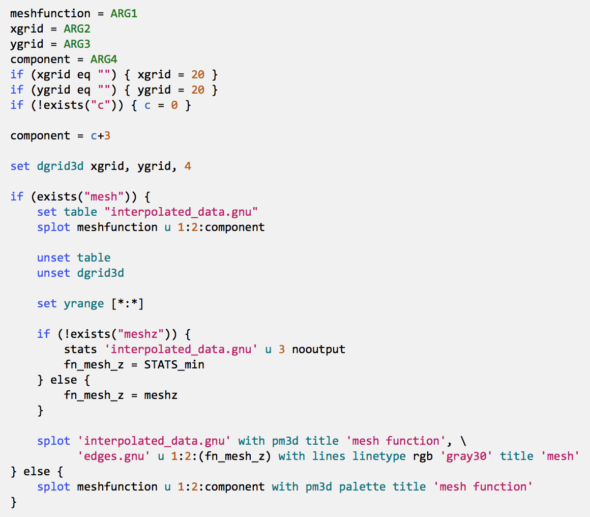

# BBEdit codeless language module for [Gnuplot](http://www.gnuplot.info)

### Example ###

### Features ###
* Highlight keywords and common abbreviations
* Highlight strings and comments
* Highlight variables and columns indexed by $1, $2, etc.
